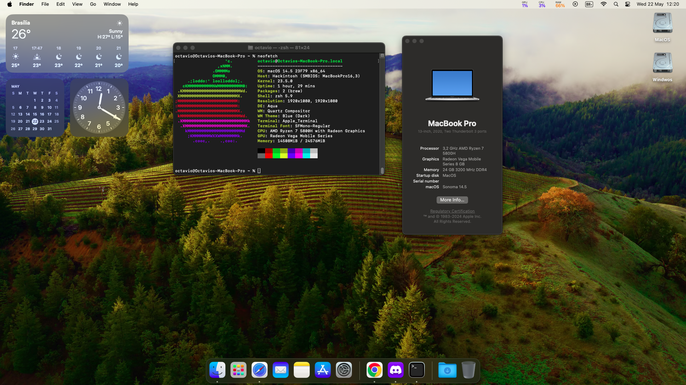

# Hackintosh Notebook IdeaPad Gaming 3 AMD Ryzen™ 7 5800H

# Resumo:

  
| Componente       | Versão                                     |
|------------------|--------------------------------------------|
| MacOS            | 14.5 Sonoma                     |
| OpenCorePkg      | [1.0.0](https://github.com/acidanthera/OpenCorePkg/releases/tag/1.0.0) |
| CPU              | AMD Ryzen 7 5800H                          |
| GPU              | Mobile Radeon™ Graphics                      |

# Features 

| Feature              | Working |
|----------------------|---------|
| GPU Fully Supported  | ✅      |
| Ethernet Network     | ✅      |
| WakeUp               | ✅      |
| Audio                | ✅      |
| Mapping USB          | ✅     |
| Wi-Fi 6 AX200 Intel®            | ✅     |
| Bluetooth            | ✅     |
| AirDrop              | ❌      |

